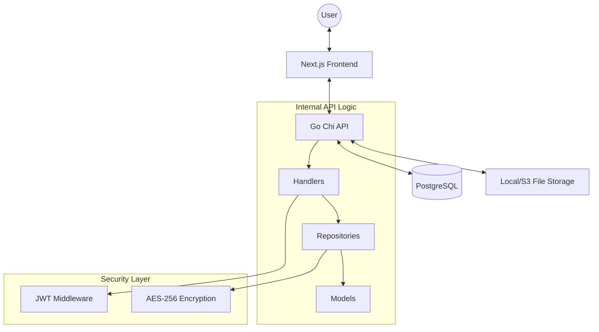

# 🎓 Campus Lost & Found

[](https://go.dev/)
[](https://nextjs.org/)
[](https://www.postgresql.org/)
[](https://www.docker.com/)

A premium, high-performance platform designed for university campuses to streamline the reporting and recovery of lost or found items. Built with a focus on **security**, **speed**, and **seamless user experience**.

---

## ✨ Key Features

- 🔐 **Secure Authentication**: Robust session management using JWT (JSON Web Tokens).
- 📦 **Item Management**: Detailed posting for Lost and Found items with categorization.
- 📸 **Photo Uploads**: Integrated image support for visual identification.
- 📍 **Location Tracking**: Precise location details for where items were lost or discovered.
- ✨ **Claim System**: Integrated workflow for users to claim found items with verification.
- 🛡️ **Privacy Guard**: Sensitive contact information is **AES-256 encrypted** at rest.
- 🔍 **Advanced Filtering**: Search and filter items by status, category, and date.
- 💻 **Admin Dashboard**: Comprehensive oversight for moderators to manage claims and reports.
- 📱 **Fully Responsive**: Optimized for desktop and mobile devices.

---

## 🛠️ Technical Excellence (The "Hard Techs")

This project leverages a sophisticated tech stack designed for scalability and production-grade reliability:

### 🚀 Backend (Go)

- **High-Performance Architecture**: Built with Go 1.24 for exceptional concurrency and memory efficiency.
- **Clean Repository Pattern**: Strict separation of concerns between handlers, models, and data access layers.
- **pgx/v5 Integration**: Utilizes the most advanced PostgreSQL driver for Go, featuring connection pooling and efficient binary protocol communication.
- **AES-256 Encryption**: Native Go implementation for encrypting PII (Personally Identifiable Information) before storage.
- **Chi Router**: Lightweight, idiomatic, and composable router for high-speed API endpoints.

### 🎨 Frontend (Next.js & React 19)

- **React 19 Core**: Utilizing the latest React features and optimizations.
- **Tailwind CSS 4**: Implementing the cutting-edge Tailwind engine for ultra-fast, utility-first styling.
- **Framer Motion**: Production-ready animations for smooth transitions and interactive micro-interactions.
- **Zod & React Hook Form**: Type-safe schema validation and efficient form management.
- **App Router Architecture**: Leverage Server and Client components for optimal performance and SEO.

### 🏗️ Infrastructure & DevSecOps

- **Dockerized Environment**: Full multi-container orchestration with Docker Compose.
- **Makefile Automation**: Streamlined development workflows with automated build and deployment scripts.
- **Security-First Design**: JWT middleware, password hashing (Bcrypt), and SQL injection protection via parameterized queries.

---

## 📐 Architecture Overview



---

## 🚦 Getting Started

### Prerequisites

- [Go 1.24+](https://go.dev/dl/)
- [Node.js 20+](https://nodejs.org/)
- [Docker & Docker Compose](https://www.docker.com/products/docker-desktop/)

### Quick Start (Docker)

The easiest way to get the entire stack running is via Docker Compose:

```bash
# Clone the repository
git clone https://github.com/yourusername/CampusLostAndFound.git
cd CampusLostAndFound

# Start the services
docker-compose up --build
```

The application will be available at:

- **Frontend**: `http://localhost:3000`
- **Backend API**: `http://localhost:8080`

### Useful Development Commands (via Makefile)

| Command        | Description                         |
| :------------- | :---------------------------------- |
| `make up`      | Start all services in detached mode |
| `make down`    | Stop and remove all containers      |
| `make migrate` | Run database migrations             |
| `make seed`    | Seed the database with initial data |
| `make test`    | Run backend test suites             |

### Manual Development Setup

#### Backend (API)

```bash
cd apps/api
go run main.go
```

#### Frontend (Web)

```bash
cd apps/web
npm install
npm run dev
```

---

## 📜 License

Created with ❤️ by the CampusLostAndFound Team.
